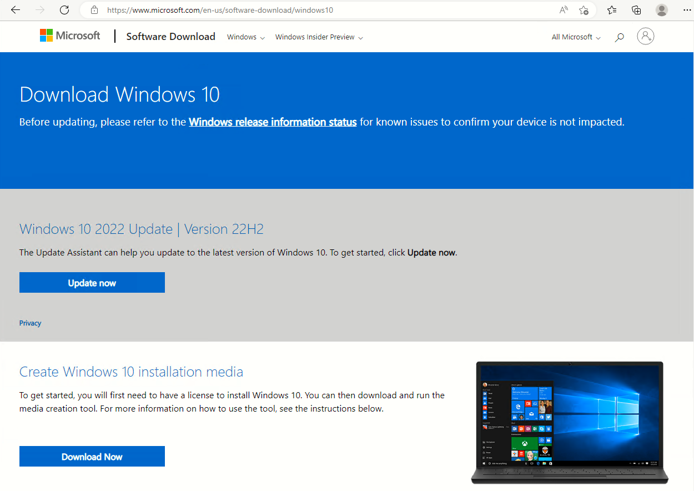
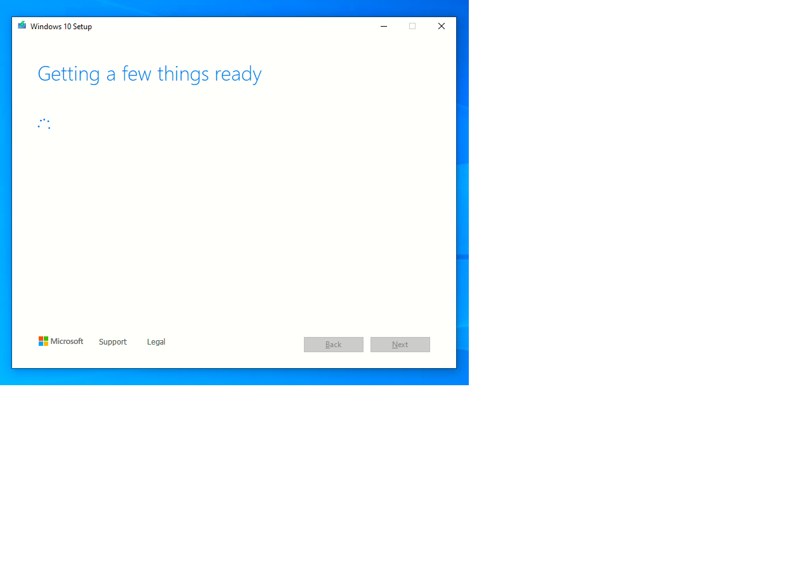

# Instalando Windows 10

Esta es mi experiencia instalando window 10 en virtual box.

Noviembre 24 de 2022

## Paso 1

Descargamos el fichero ISO de la herramienta 

``` MediaCreationTool22H2 ```

Descargada de este enlace: [pinchar aqui](https://www.microsoft.com/en-us/software-download/windows10)



Al iniciar el programa ```MediaCreationTool22H2```

Aparece el siguiente asistente:



Aceptamos el acuerdo de licencia:


