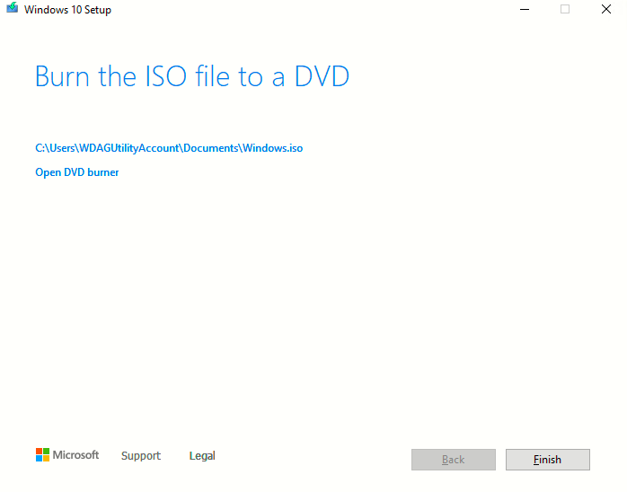

# Instalando Windows 10

Esta es mi experiencia instalando window 10 en virtual box.

Noviembre 24 de 2022

## Paso 1

Descargamos el fichero ISO de la herramienta 

``` MediaCreationTool22H2 ```

Descargada de este enlace: [pinchar aqui](https://www.microsoft.com/en-us/software-download/windows10)


Al iniciar el programa ```MediaCreationTool22H2```

Aparece el siguiente asistente:

Aceptamos el acuerdo de licencia:


Seleccionamos ```Create installation media (USB flash drive, DVD, or ISO file) for another PC```




Hasta aqui, la creación del fichero ISO y ya podremos utilizarlo en virtualBox para crear nuestra maquina virtual de Windows 10.


## Paso 2

